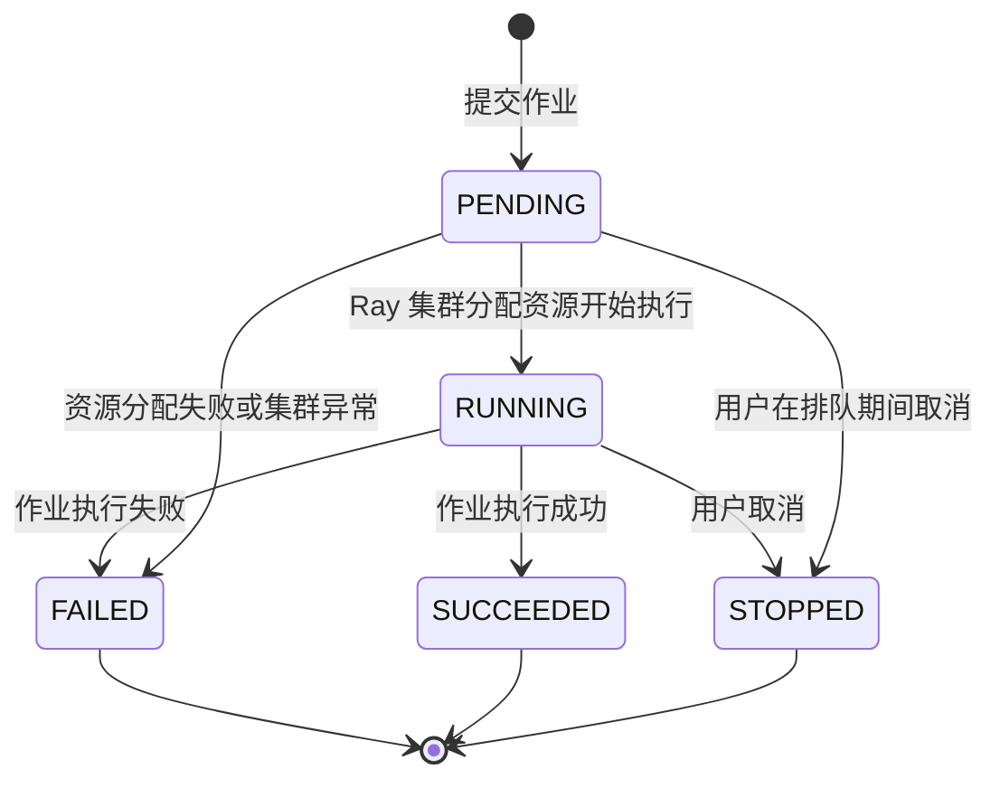
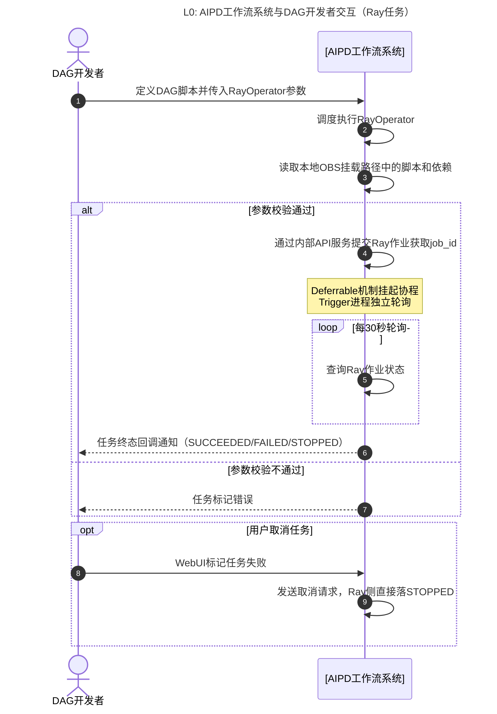
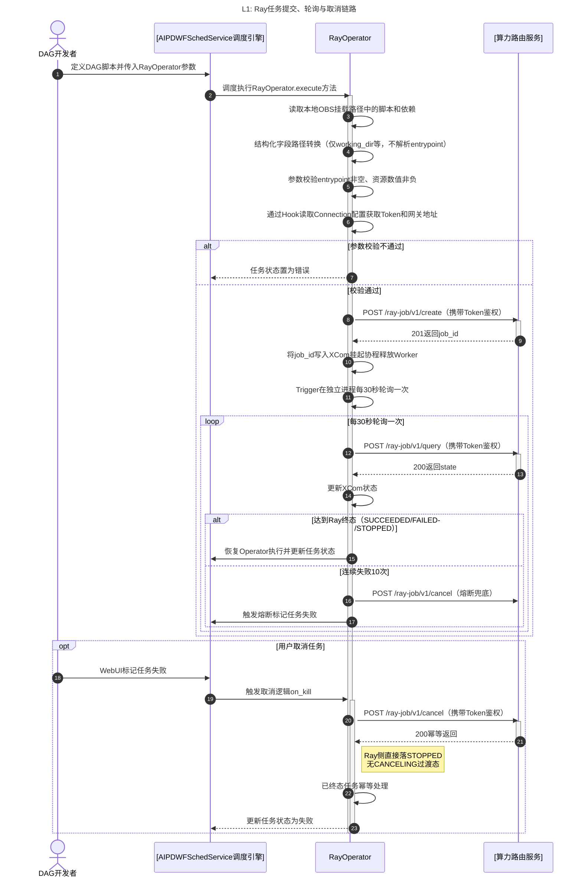
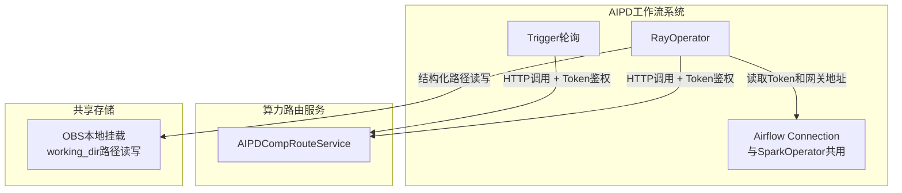

# SF20260421655713：Ray组件

> **需求来源**：[FE20260519166939-工作流支持Ray组件.md](../../fe/FE20260519166939-工作流支持Ray组件.md)
> 归属微服务：AIPDWFSchedService（Airflow Operator 部署）
> 作者：AI Agent | 创建时间：2026-05-26 | 更新日期：2026-05-26

---

## 1、功能逻辑设计

> **【方案选型说明】** 本 SF 采用"独立 RayOperator + 复用公共基类 BaseAIDataLakeOperator"方案，对应 FE §2.1 方案 B。FE 详细对比了 3 种方案（统一 AIDatalakeOperator、独立 Operator、原生 RayJobSubmissionClient），结论为：Ray 与 Spark 在资源模型、入参结构、状态机、依赖管理方式上均存在本质差异，统一 Operator 不仅无法减少用户成本，反而因条件分支和复杂验证逻辑增加维护负担；绕开网关直连 Ray 集群则破坏架构边界。独立方案让每个 Operator 与对应计算引擎 API 一一映射，复用 SparkOperator 已经验证过的基类，符合 Airflow 社区惯例。

### 1.1 RayOperator 任务提交模块

- **初始状态**：DAG 调度执行到 RayOperator 节点，等待 `execute` 方法启动。
- **交互逻辑**：
  1. 当 DAG 调度触发 RayOperator 时，`execute` 方法读取本地 OBS 挂载路径（如 `/mnt/OBS/`）中的脚本和依赖文件。
  2. 路径转换开关启用（默认）时，自动将结构化字段 `runtime_env.working_dir`、`runtime_env.py_modules` 等本地路径前缀 `/mnt/OBS/bucket/path` 转换为 `OBS://bucket/path`；`entrypoint` 命令字符串视为不透明内容，不解析、不转换。
  3. 参数校验通过后，Operator 通过 Hook 从 Airflow Connection 读取 Token 和网关地址，直接向算力网关 `POST /ray-job/v1/create` 提交作业请求（携带 Token 鉴权），获取 `job_id` 并写入 XCom。
  4. 利用 Deferrable 机制挂起协程释放 Worker 资源，交由 Trigger 异步轮询。
- **数据规则**：
  - 仅支持 `ray_python_job` 类型作业。
  - **路径转换规则**（来自 FE §2.2）：
    - 转换规则：`/mnt/OBS/bucket/path` → `OBS://bucket/path`
    - 识别范围：仅 Operator 结构化参数值（`runtime_env.working_dir`、`runtime_env.py_modules`），不解析 `entrypoint` 命令字符串
    - 转换时机：execute 阶段提交前自动完成，默认启用，可通过 `convert_obs_path=False` 关闭
    - Ray 集群通过委托机制无认证访问 OBS，无需配置认证信息
  - **任务级资源参数**：`entrypoint_num_cpus` ≥ 0、`entrypoint_num_gpus` ≥ 0、`entrypoint_memory` ≥ 0（单位 byte）；`entrypoint` 非空字符串
  - **认证方式**（来自 FE §2.3）：Operator 通过 Airflow Connection 存储的 Token 访问算力网关，用户在 Airflow UI 中创建 Connection，填写 Token 和网关地址，Operator 在 execute 方法中通过 Hook 读取 Connection 配置。用户负责 Token 的更新和轮换。RayOperator 与 SparkOperator 共用同一类型 Connection。
- **异常边界**：
  - 参数校验不通过：任务状态置为错误，日志记录字段级错误信息。
  - 提交超时/网络错误：按指数退避重试策略重试 3 次（1s/2s/4s），超过最大次数后标记失败。
  - 网关返回任务级资源不合法（CPU/GPU 配额超限）：立即抛错停止执行，不重试。
  - OBS 挂载不可用：无法读取 `runtime_env.working_dir` 内容，直接标记任务失败。

### 1.2 Trigger 异步轮询模块

- **初始状态**：作业已提交并获取 `job_id`，Trigger 在独立进程中启动周期性轮询。
- **交互逻辑**：
  1. 按默认 30s 间隔轮询算力网关状态查询接口 `POST /ray-job/v1/query`。
  2. 达到 Ray 终态（`SUCCEEDED`/`FAILED`/`STOPPED`）时触发回调恢复 Operator 执行。
- **数据规则**：轮询间隔不低于 10s；连续失败 10 次触发熔断；Ray 原生状态枚举：`PENDING`/`RUNNING`/`SUCCEEDED`/`FAILED`/`STOPPED`（无 `QUEUED`、无 `*_TIMEOUT`、无 `CANCELING` 过渡态）。
- **异常边界**：
  - 网关超时/异常：状态不刷新，等待下一周期。
  - 连续失败 10 次：触发 task_failure 回调，主动取消远程作业并恢复 Operator 标记失败。

### 1.3 任务取消模块

- **初始状态**：任务处于可取消状态（`PENDING`/`RUNNING`）。
- **交互逻辑**：
  1. 用户在 Web UI 标记任务失败时，触发 `on_kill` 钩子。
  2. 向算力网关 `POST /ray-job/v1/cancel` 发送取消请求。
  3. Ray 任务状态直接落 `STOPPED` 终态（无 `CANCELING` 过渡态）。
- **数据规则**：仅 `PENDING`/`RUNNING` 状态可取消；已终态任务取消幂等处理。
- **异常边界**：
  - 任务已终态：静默处理不报错，记录日志。
  - 网关取消请求未响应：重试 2 次后超时，记录错误日志，状态强制刷新为失败。

### 1.4 Connection 认证模块

开发人员在 Airflow Connection 中配置算力网关的认证 Token，RayOperator 执行时从 Connection 中读取凭证并直接调用网关接口。

- **初始状态**：开发人员已在 Airflow UI 中创建 Connection，填写 Token 和网关地址。
- **交互逻辑**：
  1. 开发人员在 Airflow UI 中创建 Connection（与 SparkOperator 共用同一 Connection 类型），配置网关访问 Token 和网关地址。
  2. RayOperator 在 execute 方法中通过 Hook 读取 Connection 配置。
  3. RayOperator 使用读取的 Token 直接调用算力网关接口（提交/查询/取消）。
  4. 网关返回响应给 RayOperator，包含 `job_id`/`state` 等。
- **数据规则**：
  - 开发人员在 Connection 中配置 Token，负责 Token 的更新和轮换。
  - Connection 配置包含：网关地址、认证 Token。
  - RayOperator 通过 Hook 读取 Connection 配置，获取凭证后直接调用网关。
- **异常边界**：
  - Connection 未配置或配置错误：RayOperator 读取失败，任务标记错误并记录日志。
  - Token 过期或无效：网关返回认证失败，RayOperator 重试后仍失败则标记任务失败。
  - 算力网关不可用：返回错误码供 RayOperator 重试判断。

---

## 2、权限设计

本特性为 Airflow 自定义 Operator 组件，无独立权限控制，遵循父级菜单权限（Airflow DAG 创建、执行权限、任务状态编辑权限）。

**数据权限说明**：

- 开发人员通过 Airflow Connection 配置 Token，Token 管理由开发人员负责。
- 算力网关原有 IAM 权限由网关侧控制，本 Operator 仅做透传。

**Connection 认证机制**：开发人员在 Airflow UI 中创建 Connection，填写 Token 和网关地址。RayOperator 通过 Hook 读取 Connection 配置，使用 Token 直接调用算力网关接口。与 SparkOperator 共用同一 Connection 类型，无需重复配置。

---

## 3、流程逻辑设计

### 3.1 作业状态流转图

Ray 原生状态机相比 Spark 更精简：无 `QUEUED` 排队态、无 `*_TIMEOUT` 超时细分态、取消直接落 `STOPPED` 终态（无 `CANCELING` 过渡）。



### 3.2 状态流转矩阵

| 当前状态 | 目标状态 | 触发动作 | 操作角色 | 业务规则与前置条件 |
| :--- | :--- | :--- | :--- | :--- |
| `-` | `PENDING` | 提交作业 | DAG 调度器 | 参数校验通过，OBS 挂载可用，算力网关可达，Connection 凭证有效 |
| `PENDING` | `RUNNING` | Ray 集群资源分配 | 系统自动 | Ray 集群有足够 CPU/GPU/Memory 资源满足 entrypoint_num_* 声明 |
| `PENDING` | `FAILED` | 资源分配失败 | 系统自动 | Ray 集群无法满足资源声明或集群本身异常 |
| `PENDING` | `STOPPED` | 用户取消 | 用户 | 用户在 Web UI 标记任务失败，作业尚未真正运行 |
| `RUNNING` | `SUCCEEDED` | 作业完成 | 系统自动 | entrypoint 命令正常退出（exit code 0） |
| `RUNNING` | `FAILED` | 作业异常 | 系统自动 | entrypoint 命令非零退出或运行时抛出未捕获异常 |
| `RUNNING` | `STOPPED` | 用户取消 | 用户 | 用户在 Web UI 标记任务失败，触发 on_kill |
| `PENDING/RUNNING` | `FAILED` | 熔断兜底 | 系统自动 | Trigger 连续轮询失败 10 次，主动取消远程作业并标记本地失败 |

---

## 4、实现逻辑设计

### 4.1 内外部系统交互（L0）

> L0：AIPD 工作流系统 ↔ DAG 开发者（算力网关为本应用内部服务，不出现于 L0 系统边界图）



### 4.2 内部微服务交互（L1）



### 4.3 异常设计表

| 异常触发条件（业务场景） | 预期系统妥协策略（怎么兜底） | 前端/用户感知 |
| :--- | :--- | :--- |
| Operator 参数校验不通过（entrypoint 为空 / 资源数值为负） | 不提交作业，任务直接标记错误状态 | 日志中记录字段级错误信息，Web UI 显示任务失败 |
| 提交接口超时或网络不可达 | 指数退避重试 3 次（1s/2s/4s），仍失败则标记任务失败 | Web UI 显示任务失败，提示"算力网关不可用" |
| 算力网关返回 400 参数/资源不合法 | 立即抛错不重试，记录错误详情到日志 | Web UI 显示任务失败，日志记录具体原因 |
| 算力网关临时不可用（5xx） | 提交阶段重试后标记失败；轮询阶段状态不刷新等待恢复 | Web UI 轮询状态不变，超时后标记失败 |
| OBS 挂载不可用，runtime_env.working_dir 无法读取 | 不提交作业，直接标记失败 | Web UI 显示任务失败，提示"工作目录路径不可访问" |
| 轮询连续 10 次失败 | 触发熔断，主动取消远程 Ray 作业并清理 Trigger 资源，恢复 Operator 并标记任务失败 | Web UI 显示任务失败 |
| 任务已终态（SUCCEEDED/FAILED/STOPPED）时收到取消请求 | 幂等处理返回成功，不做错误处理 | 无额外提示，任务状态保持终态 |
| 网关取消请求未响应 | 重试 2 次取消操作，超过重试次数后记录错误并强制刷新本地为失败 | Web UI 显示任务失败，提示"取消超时" |

---

## 5、类设计

**【设计意图】**
为解决 RayOperator 与算力网关的交互逻辑，采用独立 Operator 模式，**继承公共基类 `BaseAIDataLakeOperator`（与 SparkOperator 共享）** 以复用 HTTP 客户端、重试逻辑、Connection 凭证读取、OBS 结构化路径转换等通用能力。RayOperator 仅实现 Ray 引擎特定逻辑：

- 请求体构造：`jobConfig.rayPyParameter` 字段映射（entrypoint / runtime_env / entrypoint_num_cpus / entrypoint_num_gpus / entrypoint_memory）。
- Ray 原生状态枚举到 Airflow 任务状态的映射：`SUCCEEDED` → success；`FAILED`/`STOPPED` → failed；`PENDING`/`RUNNING` → 继续轮询。
- 取消接口直接落 `STOPPED` 终态的处理（无 `CANCELING` 过渡态判定逻辑，与 SparkOperator 不同）。

采用 Deferrable 机制实现异步等待。Token 管理由 Airflow Connection 提供。

遵循系统标准分层架构，无特殊类设计。

---

## 6、数据模型设计

### 6.1 物理模型

不涉及数据持久化存储。本特性为 Airflow 自定义 Operator 组件，运行于 DAG 实例生命周期内，无独立数据库表。作业状态通过 XCom 在 DAG 实例间传递，Trigger 进程轮询算力网关接口获取实时状态。

状态数据流转路径：`算力网关API → Trigger进程 → XCom → Airflow任务实例`，不落地本地持久化。

---

## 7、API 接口设计

### 7.1 算力网关接口规格

RayOperator 直接调用算力网关接口，通过 Airflow Connection 中存储的 Token 进行认证。遵循项目 API 设计规约（`design/global/api-standards.md`）强动词 RPC 风格。

**【算力网关-提交 Ray 作业 API】**

- 请求方法：`POST /ray-job/v1/create`
- 认证方式：HTTP Header 携带 Token（从 Airflow Connection 读取）
- 请求体结构：
  ```json
  {
    "workspaceId": "123456",
    "name": "ray-ml-train-job",
    "endpointName": "ep-default",
    "rayVersion": "2.9.0",
    "jobConfig": {
      "jobType": "ray_python_job",
      "rayPyParameter": {
        "entrypoint": "python train.py --epochs 10 --data OBS://bucket-name/data/",
        "runtimeEnv": {
          "workingDir": "OBS://bucket-name/ray-jobs/training/",
          "pip": ["torch==2.0.0", "transformers==4.30.0"],
          "envVars": {
            "CUDA_VISIBLE_DEVICES": "0"
          }
        },
        "entrypointNumCpus": 4.0,
        "entrypointNumGpus": 1.0,
        "entrypointMemory": 8589934592
      }
    }
  }
  ```
- 期望响应：
  ```json
  {
    "status": "OK",
    "errorCode": null,
    "errorMsg": null,
    "data": {
      "jobId": "ray-job-xxx-xxx"
    }
  }
  ```
- 异常约定：参数校验错误返回 `{"status":"ERROR","errorCode":"AIPDWD.BIZ.2060001","errorMsg":"Ray作业参数校验失败","data":null}`；资源不合法返回 `AIPDWD.BIZ.2070001`；服务端异常返回系统错误码。

**【算力网关-查询 Ray 作业状态 API】**

- 请求方法：`POST /ray-job/v1/query`
- 认证方式：HTTP Header 携带 Token（从 Airflow Connection 读取）
- 请求体结构：
  ```json
  {
    "workspaceId": "123456",
    "jobId": "ray-job-xxx-xxx"
  }
  ```
- 期望响应：
  ```json
  {
    "status": "OK",
    "errorCode": null,
    "errorMsg": null,
    "data": {
      "jobId": "ray-job-xxx-xxx",
      "state": "RUNNING"
    }
  }
  ```
- 状态枚举：`PENDING`/`RUNNING`/`SUCCEEDED`/`FAILED`/`STOPPED`（Ray 原生状态，无 `QUEUED`、无 `*_TIMEOUT`、无 `CANCELING`）
- 终态判断：`SUCCEEDED`/`FAILED`/`STOPPED` 为终态
- **说明**：响应中不含 `logPath` 字段，日志获取功能不在本版本范围

**【算力网关-取消 Ray 作业 API】**

- 请求方法：`POST /ray-job/v1/cancel`
- 认证方式：HTTP Header 携带 Token（从 Airflow Connection 读取）
- 请求体结构：
  ```json
  {
    "workspaceId": "123456",
    "jobId": "ray-job-xxx-xxx"
  }
  ```
- 期望响应：
  ```json
  {
    "status": "OK",
    "errorCode": null,
    "errorMsg": null,
    "data": null
  }
  ```
- 可取消状态：`PENDING`/`RUNNING`（Ray 无 `QUEUED` 中间态）
- 异常约定：已终态任务调用幂等处理返回成功；Ray 取消直接落 `STOPPED` 终态，无 `CANCELING` 过渡。

### 7.2 接口性能规格

| 接口路径 | 核心指标约束 | 说明 |
| :--- | :--- | :--- |
| `POST /ray-job/v1/create` | **请求超时**：30s<br>**重试策略**：3 次指数退避（1s/2s/4s）<br>**请求体大小**：不超过 50KB | 提交作业接口，请求体含 runtime_env 描述需控制大小 |
| `POST /ray-job/v1/query` | **请求超时**：10s<br>**轮询间隔**：默认 30s，最低 10s | 状态查询轻量级接口，响应快速返回 |
| `POST /ray-job/v1/cancel` | **请求超时**：10s<br>**重试策略**：2 次 | 低频操作，重试覆盖网络抖动场景 |

### 7.3 错误码清单

> **【系统简称说明】**
> - `AIPDWD`：算力网关（AIPDCompRouteService），为 AIPD 工作流系统内部服务，负责异构离线算力资源调度

| 错误码 | 错误类型 | 归属微服务 | 触发场景 | 错误描述 |
|---|---|---|---|---|
| `AIPDWD.BIZ.2060001` | 业务错误 | AIPDCompRouteService（算力路由服务） | Ray Operator 参数校验不通过（entrypoint 为空、资源数值非法等） | Ray 作业参数校验失败 |
| `AIPDWD.BIZ.2020001` | 业务错误 | AIPDCompRouteService（算力路由服务） | OBS 路径格式不正确（与 Spark 共用） | OBS 路径格式不合法 |
| `AIPDWD.SYS.9020001` | 系统错误 | AIPDCompRouteService（算力路由服务） | Connection 配置错误或 Token 无效 | 认证失败 |
| `AIPDWD.SYS.9060002` | 系统错误 | AIPDCompRouteService（算力路由服务） | 算力网关不可达或返回 5xx | 调用异构离线算力防腐网关接口失败 |
| `AIPDWD.BIZ.2070001` | 业务错误 | AIPDCompRouteService（算力路由服务） | Ray 任务级资源不合法（CPU/GPU 配额超限） | Ray 资源声明不合法 |
| `AIPDWD.SYS.9010002` | 系统错误 | AIPDCompRouteService（算力路由服务） | 作业查询返回 404 | Ray 作业不存在 |

---

## 8、集成设计

### 8.1 集成清单

> 算力网关为本应用工作流模块内部服务，非跨业务域外部集成。
> 集成调用关系已在 §4.2 L1 时序图中完整描述。

| 集成系统 | 集成类型 | 接口名称 | 调用方 | 被调用方 | 说明 |
| :--- | :--- | :--- | :--- | :--- | :--- |
| AIPDCompRouteService | 内部服务集成 | `POST /ray-job/v1/create` | RayOperator | AIPDCompRouteService | 提交 Ray 作业 |
| AIPDCompRouteService | 内部服务集成 | `POST /ray-job/v1/query` | RayOperator(Trigger) | AIPDCompRouteService | 查询 Ray 作业状态 |
| AIPDCompRouteService | 内部服务集成 | `POST /ray-job/v1/cancel` | RayOperator | AIPDCompRouteService | 取消 Ray 作业 |

### 8.2 内外部系统交互关系视图



### 8.3 Connection 认证机制

**认证方式**：开发人员在 Airflow Connection 中配置算力网关的认证 Token，RayOperator 执行时从 Connection 中读取凭证并直接调用网关接口。**与 SparkOperator 共用同一 Connection 类型**，单一 Connection 同时承载 Spark 和 Ray 提交鉴权。

**配置方式**：

- 开发人员在 Airflow UI 中创建 Connection（若已为 Spark 配置可直接复用）
- Connection 配置项：
  - Connection ID：自定义连接标识（如 `aipd_compute_gateway`）
  - Connection Type：选择 `HTTP` 或自定义类型
  - Host：算力网关地址
  - Password/Token：认证 Token 值

**凭证读取流程**：


**关键设计约束**：
1. 开发人员负责 Token 的更新和轮换，需在 Connection 中维护最新 Token。
2. RayOperator 通过 Hook 读取 Connection 配置，获取凭证后直接调用网关。
3. Connection 配置错误或 Token 过期会导致任务失败，需开发人员手动修正。
4. 当前阶段暂不考虑 Token 隔离，直接使用 Connection 方式读取秘钥，简化实现复杂度。
5. RayOperator 与 SparkOperator 共用 Connection，避免重复配置。

> **【接口契约引用】** 算力网关接口的详细规格（提交/查询/取消作业 API 的请求方法、认证方式、请求体结构、响应格式、异常约定）见 §7.1 算力网关接口规格。

---

## 9、过载控制设计

### 9.1 外部依赖防御

| 被调用依赖 | 风险点 | 过载保护策略（兜底） |
| :--- | :--- | :--- |
| 算力网关 REST API | 外部偶发超时（>30s）导致提交阶段 Worker 阻塞 | 提交阶段：超时 30s，指数退避重试 3 次（1s/2s/4s），仍失败则取消远程作业并标记本地任务失败 |
| 算力网关 REST API | 轮询期间网关持续不可用导致 Trigger 无限轮询 | 轮询阶段：状态查询超时 10s 等待下一周期；连续失败达 10 次触发熔断，主动取消远程 Ray 作业并停止轮询并执行清理释放 Trigger 资源 |
| 算力网关 REST API | 接口限流返回 429 Too Many Requests | 触发退避重试，延迟翻倍等待下一轮询周期 |
| OBS 本地挂载 | 挂载不可用导致 runtime_env.working_dir 读取失败 | 不提交作业，直接标记任务失败，日志记录路径不可用原因 |
| Airflow Connection | Connection 配置错误或 Token 过期 | RayOperator 读取 Connection 失败或网关返回认证失败，任务标记错误并记录日志 |

### 9.2 轮询限流

- 状态轮询间隔固定 `poll_interval` 参数（默认 30s），不可低于 10s。
- 日志拉取频率与状态轮询完全同步，不额外发起请求。
- 单 DAG 实例仅持有一个 Trigger 进程，无并发轮询。

---

## 10、监控 & 告警设计

本特性无额外监控告警配置。算力资源监控由算力资源平台负责，接口调用失败告警在算力网关处设计，本特性只涉及单个 DAG 实例运行结果。

---

## 11、日志设计

### 11.1 运行日志（供运维排错）

| 日志记录时间点 | 日志级别 | 日志主要字段（JSON Key） |
| :--- | :--- | :--- |
| RayOperator 执行时 | INFO | `{"action": "rayJobSubmitStart", "job_name": "", "entrypoint": "", "dag_id": "", "task_id": ""}` |
| OBS 结构化路径转换时 | INFO | `{"action": "obsPathConvert", "field": "runtime_env.working_dir", "original_path": "", "converted_path": ""}` |
| 参数校验完成时 | INFO/ERROR | `{"action": "paramValidation", "passed": true/false, "errors": ""}` |
| Connection 读取时 | INFO/ERROR | `{"action": "connectionRead", "conn_id": "", "success": true/false, "error": ""}` |
| 作业提交成功时 | INFO | `{"action": "rayJobSubmitEnd", "job_id": "", "cost_time": ""}` |
| Trigger 轮询状态时 | INFO | `{"action": "rayJobPoll", "job_id": "", "state": ""}` |
| 触发熔断时 | ERROR | `{"action": "pollingCircuitBreaker", "job_id": "", "failure_count": 10}` |
| 作业取消时 | INFO | `{"action": "rayJobCancel", "job_id": "", "state": "", "result": ""}` |
| 网关异常时 | ERROR | `{"action": "gatewayError", "job_id": "", "http_status": "", "error_code": "", "error_msg": ""}` |

---

## 12、前端设计

本特性无前端界面开发。
