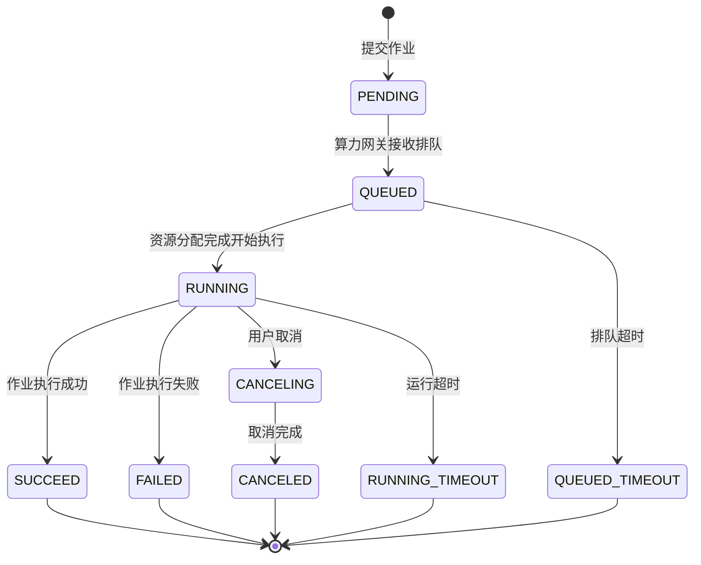
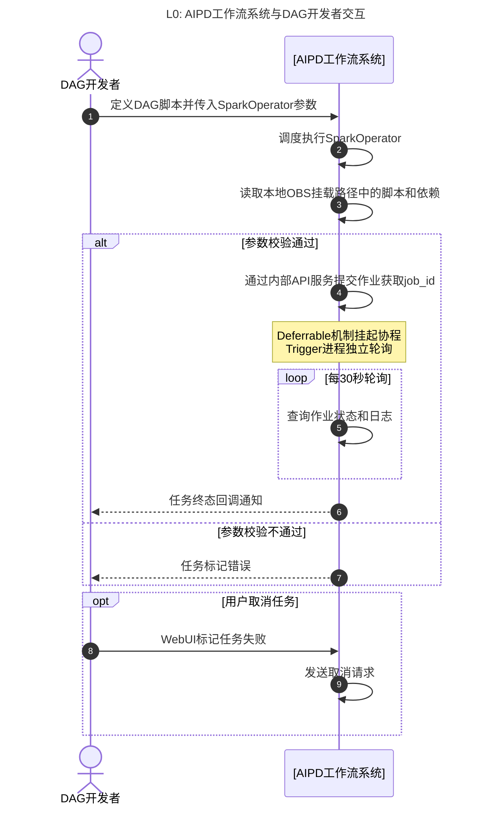
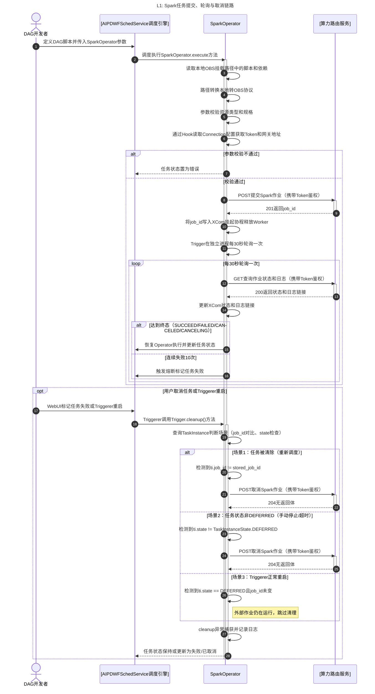
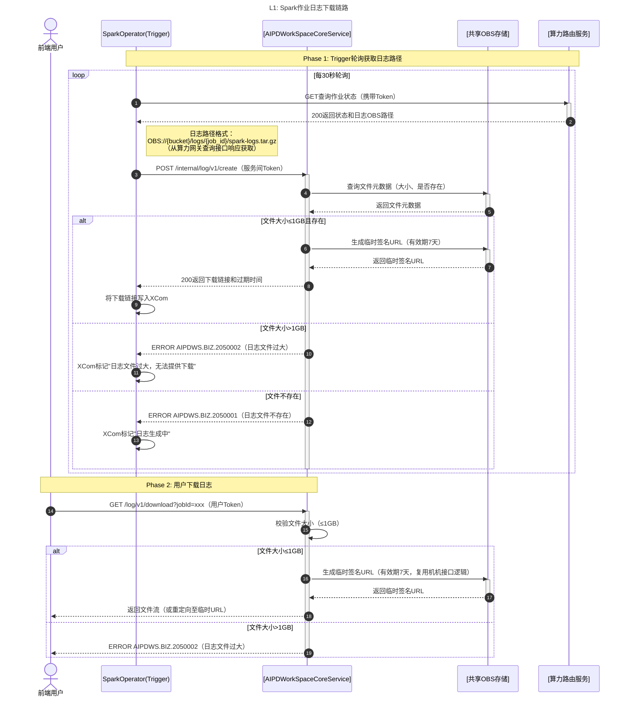
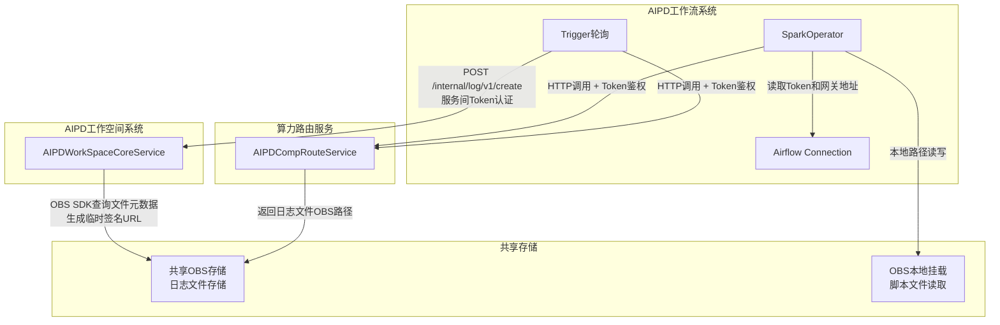

# SF20260421655859：Spark组件

> **需求来源**：[FE20260424744831-工作流支持Spark组件.md](../../fe/FE20260424744831-工作流支持Spark组件.md)
> 归属微服务：AIPDWorkSpaceCoreService（日志文件下载接口）
> 作者：AI Agent | 创建时间：2026-05-07 | 更新日期：2026-05-21

---

## 1、功能逻辑设计

> **【方案选型说明】** 本SF采用"独立SparkOperator + 公共基类BaseDataLakeOperator"方案，对应FE §2.1方案B。FE详细对比了3种方案（统一AIDatalakeOperator、独立Operator、原生SparkSubmitOperator），结论为：Spark与Ray的API接口在URL路径、请求体结构、参数维度等各方面均存在本质差异，统一Operator不仅无法减少用户成本，反而因条件分支和复杂验证逻辑增加维护负担。独立方案让每个Operator与对应计算引擎API一一映射，符合Airflow社区惯例。

### 1.1 SparkOperator任务提交模块

- **初始状态**：DAG调度执行到SparkOperator节点，等待execute方法启动。
- **交互逻辑**：
  1. 当DAG调度触发SparkOperator时，execute方法读取本地OBS挂载路径（如`/mnt/OBS/`）中的脚本和依赖文件。
  2. 路径转换开关启用（默认）时，自动将本地路径前缀`/mnt/OBS/bucket/path`转换为`OBS://bucket/path`。
  3. 参数校验通过后，Operator直接向算力网关POST提交作业请求（携带Token鉴权），获取`job_id`并写入XCom。
  4. 利用Deferrable机制挂起协程释放Worker资源，交由Trigger异步轮询。
- **数据规则**：
  - 仅支持`spark_python_job`类型作业，脚本仅支持`.py`、`.zip`格式。
  - **路径转换规则**（来自FE §2.2）：
    - 转换规则：`/mnt/OBS/bucket/path` → `OBS://bucket/path`
    - 识别范围：仅Operator参数值，不解析Spark脚本文件内容
    - 转换时机：execute阶段提交前自动完成，默认启用
    - Spark集群通过委托机制无认证访问OBS，无需配置认证信息
  - **认证方式**（来自FE §2.3）：Operator通过Airflow Connection存储的Token访问算力网关，用户在Airflow UI中创建Connection，填写Token和网关地址，Operator在execute方法中通过Hook读取Connection配置。用户负责Token的更新和轮换。
- **异常边界**：
  - 参数校验不通过：任务状态置为错误，日志记录错误信息。
  - 提交超时/网络错误：按重试策略重试，超过最大次数后标记失败。
  - 网关返回资源ID/规格不合法：立即抛错停止执行。
  - OBS挂载不可用：无法读取脚本，直接标记任务失败。

### 1.2 Trigger异步轮询模块

- **初始状态**：作业已提交并获取`job_id`，Trigger在独立进程中启动周期性轮询。
- **交互逻辑**：
  1. 按默认30s间隔轮询算力网关状态查询接口。
  2. 每次轮询同步获取日志下载链接并更新XCom。
  3. 达到终态（SUCCEED/FAILED/CANCELED/CANCELING）时触发回调恢复Operator执行。
- **数据规则**：轮询间隔不低于10s；连续失败10次触发熔断。
- **异常边界**：
  - 网关超时/异常：状态不刷新，等待下一周期。
  - 连续失败10次：触发task_failure回调，恢复Operator并标记失败。
  - 日志接口返回空：日志链接不更新，页面提示"日志生成中"。
  - 日志超1GB：停止更新链接，提示"日志文件过大，无法提供下载"。

### 1.3 任务取消模块

> **【关键技术约束】** 在可延迟操作符（Deferrable Operator）中，当任务提交外部作业并进入 `deferred` 状态后，Worker 上的 `on_kill` 方法**不会被调用**（官方 Issue #36090 已确认）。正确方案是在 Trigger 的 `cleanup()` 方法中实现外部作业清理逻辑。

- **初始状态**：任务处于可取消状态（PENDING/QUEUED/RUNNING），Trigger 正在轮询。
- **交互逻辑**：
  1. 用户在Web UI标记任务失败时，Airflow 调用 Trigger 的 `cleanup()` 方法。
  2. `cleanup()` 方法通过任务状态判断区分场景：
     - **场景1：任务被清除（重新调度）**：检查 `ti.job_id != self.stored_job_id`，若不同则调用取消接口。
     - **场景2：任务状态非 DEFERRED（手动停止/超时/失败）**：检查 `ti.state != TaskInstanceState.DEFERRED`，若非 DEFERRED 则调用取消接口。
     - **场景3：Triggerer 正常重启**：任务仍处于 DEFERRED 状态且 job_id 未变，**不执行清理**（外部作业仍在运行）。
  3. 若判定需要取消，向算力网关发送POST取消请求。
  4. 任务状态更新为失败或已取消。
- **数据规则**：
  - 仅PENDING/QUEUED/RUNNING状态可取消；已终态任务取消幂等处理。
  - Trigger 必须存储 Operator 传递的 `ti.job_id`，用于判断任务是否被清除。
  - `cleanup()` 必须是 `async def` 方法（Airflow 2.6+ 要求）。
  - `cleanup()` 中的异常会被静默忽略，需自行 try/catch 并记录日志。
- **异常边界**：
  - 任务已终态：静默处理不报错，记录日志。
  - 网关取消请求未响应：重试后超时，记录错误日志，状态刷新为失败。
  - Triggerer 重启场景：误判为需要取消导致杀掉正常作业（通过 job_id 和 state 双重校验避免）。
  - cleanup 方法异常：异常被静默忽略，需在方法内部捕获并记录日志。

### 1.4 Connection认证模块

开发人员在Airflow Connection中配置算力网关的认证Token，Operator执行时从Connection中读取凭证并直接调用网关接口。

- **初始状态**：开发人员已在Airflow UI中创建Connection，填写Token和网关地址。
- **交互逻辑**：
  1. 开发人员在Airflow UI中创建Connection，配置网关访问Token和网关地址。
  2. Operator在execute方法中通过Hook读取Connection配置。
  3. Operator使用读取的Token直接调用算力网关接口（提交/查询/取消）。
  4. 网关返回响应给Operator，包含job_id/状态/日志链接等。
- **数据规则**：
  - 开发人员在Connection中配置Token，负责Token的更新和轮换。
  - Connection配置包含：网关地址、认证Token。
  - Operator通过Hook读取Connection配置，获取凭证后直接调用网关。
- **异常边界**：
  - Connection未配置或配置错误：Operator读取失败，任务标记错误并记录日志。
  - Token过期或无效：网关返回认证失败，Operator重试后仍失败则标记任务失败。
  - 算力网关不可用：返回错误码供Operator重试判断。

### 1.5 日志下载模块

日志文件由外部算力集群写入共享OBS，Operator通过调用WorkspaceCoreService机机接口生成临时下载链接，用户通过人机接口下载日志。

- **初始状态**：Spark作业运行中或已终态，日志文件已由外部算力集群写入共享OBS。
- **交互逻辑**：
  1. 当Trigger轮询获取作业状态时，算力网关返回日志文件OBS路径（`OBS://{bucket}/logs/{job_id}/spark-logs.tar.gz`）。
  2. Operator调用WorkspaceCoreService内部机机接口（`POST /internal/log/v1/create`），传入job_id和log_path（log_path从算力网关查询接口响应中获取）。
  3. WorkspaceCoreService校验日志文件大小（≤1GB），生成OBS临时签名URL（有效期7天），返回下载链接。
  4. Operator将下载链接写入XCom，供前端任务详情页展示。
  5. 用户点击下载按钮时，前端调用WorkspaceCoreService人机接口（`GET /log/v1/download`），携带job_id参数。
  6. WorkspaceCoreService校验用户权限、文件大小（≤1GB），返回文件流或重定向至临时签名URL。
- **数据规则**：
  - **日志存储路径规范**：`OBS://{bucket}/logs/{job_id}/spark-logs.tar.gz`
    - bucket：共享OBS桶名，由系统配置统一管理
    - job_id：Spark作业ID，作业级隔离
    - 文件格式：tar.gz压缩包，包含stdout/stderr日志文件
    - **路径来源**：算力网关查询接口响应中的logPath字段
  - **临时URL有效期**：7天，过期后需重新调用机机接口生成
  - **文件大小校验**：超过1GB不生成下载链接，返回"日志文件过大"错误
- **异常边界**：
  - 日志文件不存在：机机接口返回错误码`AIPDWS.BIZ.2050001`，前端提示"日志文件不存在或已被清理"
  - 日志文件超过1GB：机机接口返回错误码`AIPDWS.BIZ.2050002`，前端提示"日志文件过大，无法提供下载"
  - OBS临时URL生成失败：机机接口返回系统错误码`AIPDWS.SYS.9060003`，前端提示"下载链接生成失败，请稍后重试"
  - 临时URL已过期：人机接口返回错误码`AIPDWS.BIZ.2050004`，前端提示"下载链接已过期，请刷新页面重新获取"

---

## 2、权限设计

本特性为Airflow自定义Operator组件，无独立权限控制，遵循父级菜单权限（Airflow DAG创建、执行权限、任务状态编辑权限）。

**数据权限说明**：

- 开发人员通过Airflow Connection配置Token，Token管理由开发人员负责。
- 算力网关原有IAM权限由网关侧控制，本Operator仅做透传。

**Connection认证机制**：开发人员在Airflow UI中创建Connection，填写Token和网关地址。Operator通过Hook读取Connection配置，使用Token直接调用算力网关接口。

---

## 3、流程逻辑设计

### 3.1 作业状态流转图



### 3.2 状态流转矩阵

| 当前状态 | 目标状态 | 触发动作 | 操作角色 | 业务规则与前置条件 |
| :--- | :--- | :--- | :--- | :--- |
| `-` | `PENDING` | 提交作业 | DAG调度器 | 参数校验通过，OBS挂载可用，内部API服务可达 |
| `PENDING` | `QUEUED` | 算力网关调度 | 系统自动 | 网关接收作业请求，进入队列等待资源分配 |
| `QUEUED` | `RUNNING` | 算力网关资源分配 | 系统自动 | 计算资源可用，作业开始执行 |
| `QUEUED` | `QUEUED_TIMEOUT` | 排队超时 | 系统自动 | 超过queued_timeout配置（默认3小时） |
| `RUNNING` | `SUCCEED` | 作业完成 | 系统自动 | 作业正常执行结束 |
| `RUNNING` | `FAILED` | 作业异常 | 系统自动 | 执行过程中发生不可恢复错误 |
| `RUNNING` | `RUNNING_TIMEOUT` | 运行超时 | 系统自动 | 超过running_timeout配置（默认不限制） |
| `RUNNING` | `CANCELING` | 用户取消 | 用户 | 仅PENDING/QUEUED/RUNNING状态可取消 |
| `CANCELING` | `CANCELED` | 取消完成 | 系统自动 | 算力网关接受取消请求并完成 |
| `PENDING/QUEUED/RUNNING` | `FAILED` | 取消后终态 | 系统自动 | 任务取消成功或触发超时/网关异常 |

---

## 4、实现逻辑设计

### 4.1 内外部系统交互（L0）

> L1：AIPD工作流系统 ↔ DAG开发者（算力网关为本应用内部服务，不出现于L0系统边界图）



### 4.2 内部微服务交互（L1）



### 4.3 日志下载链路（L1）



### 4.4 异常设计表

| 异常触发条件（业务场景） | 预期系统妥协策略（怎么兜底） | 前端/用户感知 |
| :--- | :--- | :--- |
| Operator参数校验不通过（resourceType/resourceSpec非法） | 不提交作业，任务直接标记错误状态 | 日志中记录错误信息，Web UI显示任务失败 |
| 提交接口超时或网络不可达 | 指数退避重试3次（1s/2s/4s），仍失败则标记任务失败 | Web UI显示任务失败，提示"算力网关不可用" |
| 算力网关返回400参数/资源不合法 | 立即抛错不重试，记录错误详情到日志 | Web UI显示任务失败，日志记录具体原因 |
| 算力网关临时不可用（5xx） | 提交阶段重试后标记失败；轮询阶段状态不刷新等待恢复 | Web UI轮询状态不变，超时后标记失败 |
| OBS挂载不可用无法读取脚本 | 不提交作业，直接标记失败 | Web UI显示任务失败，提示"脚本路径不可访问" |
| 轮询连续10次失败 | 触发熔断，停止轮询并清理Trigger资源，恢复Operator并标记任务失败 | Web UI显示任务失败 |
| 任务已终态时收到取消请求（cleanup调用） | 幂等处理返回成功，不做错误处理 | 无额外提示，任务状态保持终态 |
| 网关取消请求未响应（cleanup调用） | 重试取消操作，超过重试次数后记录错误并标记失败 | Web UI显示任务失败，提示"取消超时" |
| Triggerer重启触发cleanup调用 | 通过job_id和state校验判断为重启场景，跳过清理不调用取消接口 | 无提示，外部作业继续运行，Trigger恢复轮询 |
| cleanup方法执行异常 | 异常被Airflow静默忽略，需在方法内部捕获并记录日志 | 日志记录cleanup异常，不影响任务状态流转 |
| 任务被清除（重新调度）触发cleanup | 检测到job_id变化，调用取消接口清理旧作业 | 旧作业被取消，新任务重新提交 |
| 日志文件大小超过1GB | 停止更新下载链接，在XCom中标记超限 | 日志页签显示"日志文件过大，无法提供下载" |
| 日志接口返回空 | 日志链接不更新，XCom保留上一次有效值 | 日志页签显示"日志生成中" |
| 日志文件不存在或已被清理 | 机机接口返回错误码，Operator标记"日志生成中" | 日志页签显示"日志生成中" |
| OBS临时URL生成失败 | 机机接口返回系统错误码，Operator记录错误日志 | 日志页签显示"下载链接生成失败，请稍后重试" |
| OBS临时URL已过期 | 人机接口返回错误码，前端提示刷新 | 提示"下载链接已过期，请刷新页面重新获取" |

---

## 5、类设计

**【设计意图】**
为解决SparkOperator与算力网关的交互逻辑，采用独立Operator模式，继承公共基类`BaseDataLakeOperator`复用HTTP客户端和重试逻辑。采用Deferrable机制实现异步等待。Token管理由内部API服务通过FD安全注入实现。

**【关键技术约束】**
在可延迟操作符（Deferrable Operator）中，当任务提交外部作业并进入 `deferred` 状态后，Worker 上的 `on_kill` 方法**不会被调用**（官方 Issue #36090）。因此，任务取消逻辑必须在 Trigger 的 `cleanup()` 方法中实现，通过任务状态判断区分三种场景：
1. **任务被清除（重新调度）**：检查 `ti.job_id != stored_job_id`，调用取消接口
2. **任务状态非 DEFERRED（手动停止/超时）**：检查 `ti.state != TaskInstanceState.DEFERRED`，调用取消接口
3. **Triggerer 正常重启**：检查 `ti.state == DEFERRED` 且 `job_id` 未变，跳过清理（外部作业仍在运行）

遵循系统标准分层架构，无特殊类设计。

---

## 6、数据模型设计

### 6.1 物理模型

不涉及数据持久化存储。本特性为Airflow自定义Operator组件，运行于DAG实例生命周期内，无独立数据库表。作业状态通过XCom在DAG实例间传递，Trigger进程轮询算力网关接口获取实时状态。

状态数据流转路径：`算力网关API → Trigger进程 → XCom → Airflow任务实例`，不落地本地持久化。

---

## 7、API接口设计

### 7.1 算力网关接口规格

Operator直接调用算力网关接口，通过Airflow Connection中存储的Token进行认证。遵循项目API设计规约（`design/global/api-standards.md`）强动词RPC风格。

**【算力网关-提交作业 API】**

- 请求方法：`POST /spark-job/v1/create`
- 认证方式：HTTP Header携带Token（从Airflow Connection读取）
- 请求体结构：
  ```json
  {
    "workspaceId": "123456",
    "name": "spark-etl-job",
    "endpointName": "ep-default",
    "sparkVersion": "3.3.2",
    "jobConfig": {
      "jobType": "spark_python_job",
      "sparkPyParameter": {
        "mainPythonFile": "OBS://bucket-name/pyspark/etl.py",
        "mainArgs": ["--output", "OBS://bucket-name/output/"],
        "dependencyPyFiles": ["OBS://bucket-name/libs/util.zip"]
      }
    },
    "resourceConfig": {
      "driverResourceSpec": {"cpu": 2, "memory": "4GB"},
      "executorResourceSpec": {"cpu": 2, "memory": "4GB"},
      "executorNumber": 4
    }
  }
  ```
- 期望响应：
  ```json
  {
    "status": "OK",
    "errorCode": null,
    "errorMsg": null,
    "data": {
      "jobId": "xxx-xxx"
    }
  }
  ```
- 异常约定：参数校验错误返回`{"status":"ERROR","errorCode":"AIPDWD.BIZ.2010001","errorMsg":"Spark作业参数校验失败","data":null}`；服务端异常返回系统错误码。

**【算力网关-查询作业状态 API】**

- 请求方法：`POST /spark-job/v1/query`
- 认证方式：HTTP Header携带Token（从Airflow Connection读取）
- 请求体结构：
  ```json
  {
    "workspaceId": "123456",
    "jobId": "xxx-xxx"
  }
  ```
- 期望响应：
  ```json
  {
    "status": "OK",
    "errorCode": null,
    "errorMsg": null,
    "data": {
      "jobId": "xxx-xxx",
      "state": "RUNNING",
      "logPath": "OBS://{bucket}/logs/{job_id}/spark-logs.tar.gz"
    }
  }
  ```
- 状态枚举：PENDING/QUEUED/RUNNING/CANCELING/CANCELED/FAILED/QUEUED_TIMEOUT/RUNNING_TIMEOUT/SUCCEED
- 终态判断：SUCCEED/FAILED/CANCELED 为终态（CANCELING为中间态，会流转至CANCELED）

**【算力网关-取消作业 API】**

- 请求方法：`POST /spark-job/v1/cancel`
- 认证方式：HTTP Header携带Token（从Airflow Connection读取）
- 请求体结构：
  ```json
  {
    "workspaceId": "123456",
    "jobId": "xxx-xxx"
  }
  ```
- 期望响应：
  ```json
  {
    "status": "OK",
    "errorCode": null,
    "errorMsg": null,
    "data": null
  }
  ```
- 可取消状态：PENDING/QUEUED/RUNNING
- 异常约定：已终态任务调用幂等处理返回成功。

### 7.2 接口性能规格

| 接口路径 | 核心指标约束 | 说明 |
| :--- | :--- | :--- |
| `POST /spark-job/v1/create` | **请求超时**：30s<br>**重试策略**：3次指数退避（1s/2s/4s）<br>**请求体大小**：不超过50KB | 提交作业接口，超时包含网关处理耗时 |
| `POST /spark-job/v1/query` | **请求超时**：10s<br>**轮询间隔**：默认30s，最低10s | 状态查询轻量级接口，响应快速返回 |
| `POST /spark-job/v1/cancel` | **请求超时**：10s<br>**重试策略**：2次 | 低频操作，重试覆盖网络抖动场景 |

### 7.3 错误码清单

> **【系统简称说明】**
> - `AIPDWD`：算力网关（AIPDCompRouteService），为AIPD工作流系统内部服务，负责异构离线算力资源调度
> - `AIPDWS`：AIPDWorkSpaceCoreService，负责工作空间核心功能及日志下载接口

| 错误码 | 错误类型 | 归属微服务 | 触发场景 | 错误描述 |
|---|---|---|---|---|
| `AIPDWD.BIZ.2010001` | 业务错误 | AIPDCompRouteService（算力路由服务） | Operator参数校验不通过 | Spark作业参数校验失败 |
| `AIPDWD.BIZ.2020001` | 业务错误 | AIPDCompRouteService（算力路由服务） | OBS路径格式不正确 | OBS路径格式不合法 |
| `AIPDWD.SYS.9020001` | 系统错误 | AIPDCompRouteService（算力路由服务） | Connection配置错误或Token无效 | 认证失败 |
| `AIPDWD.SYS.9060002` | 系统错误 | AIPDCompRouteService（算力路由服务） | 算力网关不可达或返回5xx | 调用异构离线算力防腐网关接口失败 |
| `AIPDWD.BIZ.2040001` | 业务错误 | AIPDCompRouteService（算力路由服务） | 作业提交后网关返回资源/规格不合法 | 资源ID或规格不合法 |
| `AIPDWD.SYS.9010002` | 系统错误 | AIPDCompRouteService（算力路由服务） | 作业查询返回404 | Spark作业不存在 |
| `AIPDWS.BIZ.2050001` | 业务错误 | AIPDWorkSpaceCoreService | 日志文件不存在或已被清理 | 日志文件不存在 |
| `AIPDWS.BIZ.2050002` | 业务错误 | AIPDWorkSpaceCoreService | 日志文件大小超过1GB | 日志文件过大，无法提供下载 |
| `AIPDWS.SYS.9060003` | 系统错误 | AIPDWorkSpaceCoreService | OBS临时签名URL生成失败 | 下载链接生成失败 |
| `AIPDWS.BIZ.2050004` | 业务错误 | AIPDWorkSpaceCoreService | OBS临时签名URL已过期 | 下载链接已过期 |

### 7.4 WorkspaceCoreService日志下载接口规格

> **【接口归属说明】**：日志下载接口归属AIPDWorkSpaceCoreService，包含一个内部机机接口（Operator调用）和一个标准人机接口（用户调用）。接口路径遵循API设计规约中的机机/人机隔离规则。

**【机机接口-生成日志下载链接】**

- **接口路径**：`POST /internal/log/v1/create`
- **归属服务**：AIPDWorkSpaceCoreService
- **接口类型**：内部机机接口（Controller位于`api`包）
- **认证方式**：服务间内部Token认证（通过HTTP Header `X-Internal-Auth-Token`传递）
- **调用方**：SparkOperator（Trigger进程轮询时调用）
- **请求体结构**：
  ```json
  {
    "jobId": "spark-job-xxx-xxx",
    "logPath": "OBS://aipd-shared-logs/logs/spark-job-xxx-xxx/spark-logs.tar.gz"
  }
  ```
  > **参数来源说明**：`jobId`从XCom获取，`logPath`从算力网关状态查询接口响应中获取（见§7.1查询接口响应体中的logPath字段）。
- **期望响应**：
  ```json
  {
    "status": "OK",
    "errorCode": null,
    "errorMsg": null,
    "data": {
      "downloadUrl": "https://obs.cn-north-1.huawei.com/aipd-shared-logs/logs/123456/spark-job-xxx-xxx/spark-logs.tar.gz?signature=xxx&expires=3600",
      "expiresAt": "2026-05-30T10:00:00Z",
      "fileSize": 102400000,
      "fileExists": true
    }
  }
  ```
- **业务逻辑**：
  1. 校验日志文件OBS路径格式合法性
  2. 通过OBS SDK查询文件元数据（大小、是否存在）
  3. 若文件大小超过1GB，返回错误码`AIPDWS.BIZ.2050002`
  4. 若文件不存在，返回错误码`AIPDWS.BIZ.2050001`
  5. 生成OBS临时签名URL（有效期7天，仅允许GET操作）
  6. 返回下载链接、过期时间、文件大小
- **异常约定**：
  - 文件不存在：`{"status":"ERROR","errorCode":"AIPDWS.BIZ.2050001","errorMsg":"日志文件不存在或已被清理","data":null}`
  - 文件超限：`{"status":"ERROR","errorCode":"AIPDWS.BIZ.2050002","errorMsg":"日志文件过大，无法提供下载","data":null}`
  - OBS服务异常：`{"status":"ERROR","errorCode":"AIPDWS.SYS.9060003","errorMsg":"下载链接生成失败","data":null}`

**【人机接口-下载日志文件】**

- **接口路径**：`GET /log/v1/download`
- **归属服务**：AIPDWorkSpaceCoreService
- **接口类型**：标准人机接口（Controller位于`controller`包）
- **认证方式**：网关统一鉴权（用户身份Token）
- **调用方**：前端用户（任务详情页点击下载按钮）
- **请求参数**（URL Query）：
  - `jobId`（必填）：Spark作业ID
- **期望响应**：
  - 成功：返回文件流（Content-Type: application/octet-stream，Content-Disposition: attachment; filename="spark-logs.tar.gz"）
  - 失败：返回标准错误响应结构
- **业务逻辑**：
  1. 调用内部方法生成临时签名URL（复用机机接口逻辑）
  2. 若文件大小超过1GB，返回错误码`AIPDWS.BIZ.2050002`
  3. 返回文件流或重定向至临时签名URL（优先返回文件流，避免URL暴露）
- **异常约定**：
  - 文件超限：`{"status":"ERROR","errorCode":"AIPDWS.BIZ.2050002","errorMsg":"日志文件过大，无法提供下载","data":null}`
  - URL过期：`{"status":"ERROR","errorCode":"AIPDWS.BIZ.2050004","errorMsg":"下载链接已过期，请刷新页面重新获取","data":null}`

### 7.5 日志下载接口性能规格

| 接口路径 | 核心指标约束 | 说明 |
| :--- | :--- | :--- |
| `POST /internal/log/v1/create` | **请求超时**：5s<br>**文件大小校验**：≤1GB<br>**临时URL有效期**：7天 | 机机接口，Trigger轮询时调用，需快速返回避免阻塞轮询周期 |
| `GET /log/v1/download` | **请求超时**：30s<br>**文件大小校验**：≤1GB | 人机接口，用户主动触发下载，超时时间较长以支持大文件传输 |

---

## 8、集成设计

### 8.1 集成清单

> 算力网关为本应用工作流模块内部服务，非跨业务域外部集成。WorkspaceCoreService为本应用工作空间模块核心服务，提供日志下载接口供Operator调用。
> 集成调用关系已在 §4.2 L1 时序图、§4.3 日志下载链路 和 §8.2 关系视图 中完整描述。

| 集成系统 | 集成类型 | 接口名称 | 调用方 | 被调用方 | 说明 |
| :--- | :--- | :--- | :--- | :--- | :--- |
| AIPDWorkSpaceCoreService | 内部服务集成 | `POST /internal/log/v1/create` | SparkOperator(Trigger) | WorkspaceCoreService | 机机接口，传入jobId生成日志下载临时URL |
| AIPDWorkSpaceCoreService | 内部服务集成 | `GET /log/v1/download` | 前端用户 | WorkspaceCoreService | 人机接口，传入jobId下载日志文件 |
| 共享OBS存储 | 外部依赖集成 | OBS SDK API | WorkspaceCoreService | OBS | 查询文件元数据、生成临时签名URL |
| AIPDCompRouteService | 内部服务集成 | `POST /spark-job/v1/create` | SparkOperator | AIPDCompRouteService | 提交Spark作业 |
| AIPDCompRouteService | 内部服务集成 | `POST /spark-job/v1/query` | SparkOperator(Trigger) | AIPDCompRouteService | 查询Spark作业状态 |
| AIPDCompRouteService | 内部服务集成 | `POST /spark-job/v1/cancel` | SparkOperator | AIPDCompRouteService | 取消Spark作业 |

### 8.2 内外部系统交互关系视图



### 8.3 Connection认证机制

**认证方式**：开发人员在Airflow Connection中配置算力网关的认证Token，Operator执行时从Connection中读取凭证并直接调用网关接口。

**配置方式**：
- 开发人员在Airflow UI中创建Connection
- Connection配置项：
  - Connection ID：自定义连接标识（如`spark_gateway`）
  - Connection Type：选择`HTTP`或自定义类型
  - Host：算力网关地址
  - Password/Token：认证Token值

**凭证读取流程**：


**关键设计约束**：
1. 开发人员负责Token的更新和轮换，需在Connection中维护最新Token。
2. Operator通过Hook读取Connection配置，获取凭证后直接调用网关。
3. Connection配置错误或Token过期会导致任务失败，需开发人员手动修正。
4. 当前阶段暂不考虑Token隔离，直接使用Connection方式读取秘钥，简化实现复杂度。

> **【接口契约引用】** 算力网关接口的详细规格（提交/查询/取消作业API的请求方法、认证方式、请求体结构、响应格式、异常约定）见 §7.1 算力网关接口规格。

---

## 9、过载控制设计

### 9.1 外部依赖防御

| 被调用依赖 | 风险点 | 过载保护策略（兜底） |
| :--- | :--- | :--- |
| 算力网关REST API | 外部偶发超时（>30s）导致提交阶段Worker阻塞 | 提交阶段：超时30s，指数退避重试3次（1s/2s/4s），仍失败则取消远程作业并标记本地任务失败 |
| 算力网关REST API | 轮询期间网关持续不可用导致Trigger无限轮询 | 轮询阶段：状态查询超时10s等待下一周期；连续失败达10次触发熔断，停止轮询并执行清理释放Trigger资源 |
| 算力网关REST API | 接口限流返回429 Too Many Requests | 触发退避重试，延迟翻倍等待下一轮询周期 |
| OBS本地挂载 | 挂载不可用导致脚本读取失败 | 不提交作业，直接标记任务失败，日志记录路径不可用原因 |
| Airflow Connection | Connection配置错误或Token过期 | Operator读取Connection失败或网关返回认证失败，任务标记错误并记录日志 |

### 9.2 轮询限流

- 状态轮询间隔固定`poll_interval`参数（默认30s），不可低于10s。
- 日志拉取频率与状态轮询完全同步，不额外发起请求。
- 单DAG实例仅持有一个Trigger进程，无并发轮询。

---

## 10、监控 & 告警设计

本特性无额外监控告警配置。算力资源监控由算力资源平台负责，接口调用失败告警在算力网关处设计，本特性只涉及单个DAG实例运行结果。

---

## 11、日志设计

### 11.1 运行日志（供运维排错）

| 日志记录时间点 | 日志级别 | 日志主要字段（JSON Key） |
| :--- | :--- | :--- |
| SparkOperator执行时 | INFO | `{"action": "sparkJobSubmitStart", "job_name": "", "main_python_file": "", "dag_id": "", "task_id": ""}` |
| OBS路径转换时 | INFO | `{"action": "obsPathConvert", "original_path": "", "converted_path": ""}` |
| 参数校验完成时 | INFO/ERROR | `{"action": "paramValidation", "passed": true/false, "errors": ""}` |
| Connection读取时 | INFO/ERROR | `{"action": "connectionRead", "conn_id": "", "success": true/false, "error": ""}` |
| 作业提交成功时 | INFO | `{"action": "sparkJobSubmitEnd", "job_id": "", "cost_time": ""}` |
| Trigger轮询状态时 | INFO | `{"action": "sparkJobPoll", "job_id": "", "state": "", "log_url": ""}` |
| Trigger cleanup调用时 | INFO | `{"action": "triggerCleanupStart", "job_id": "", "trigger_id": "", "ti_state": "", "ti_job_id": "", "stored_job_id": ""}` |
| cleanup判定场景时 | INFO | `{"action": "cleanupScenarioDecision", "job_id": "", "scenario": "restart/clear/non_deferred", "skip_cleanup": true/false}` |
| cleanup取消作业时 | INFO | `{"action": "cleanupCancelJob", "job_id": "", "result": ""}` |
| cleanup异常捕获时 | ERROR | `{"action": "cleanupException", "job_id": "", "error": ""}` |
| 触发熔断时 | ERROR | `{"action": "pollingCircuitBreaker", "job_id": "", "failure_count": 10}` |
| 作业取消时 | INFO | `{"action": "sparkJobCancel", "job_id": "", "state": "", "result": ""}` |
| 网关异常时 | ERROR | `{"action": "gatewayError", "job_id": "", "http_status": "", "error_code": "", "error_msg": ""}` |

---

## 12、前端设计

本特性无前端界面开发。
