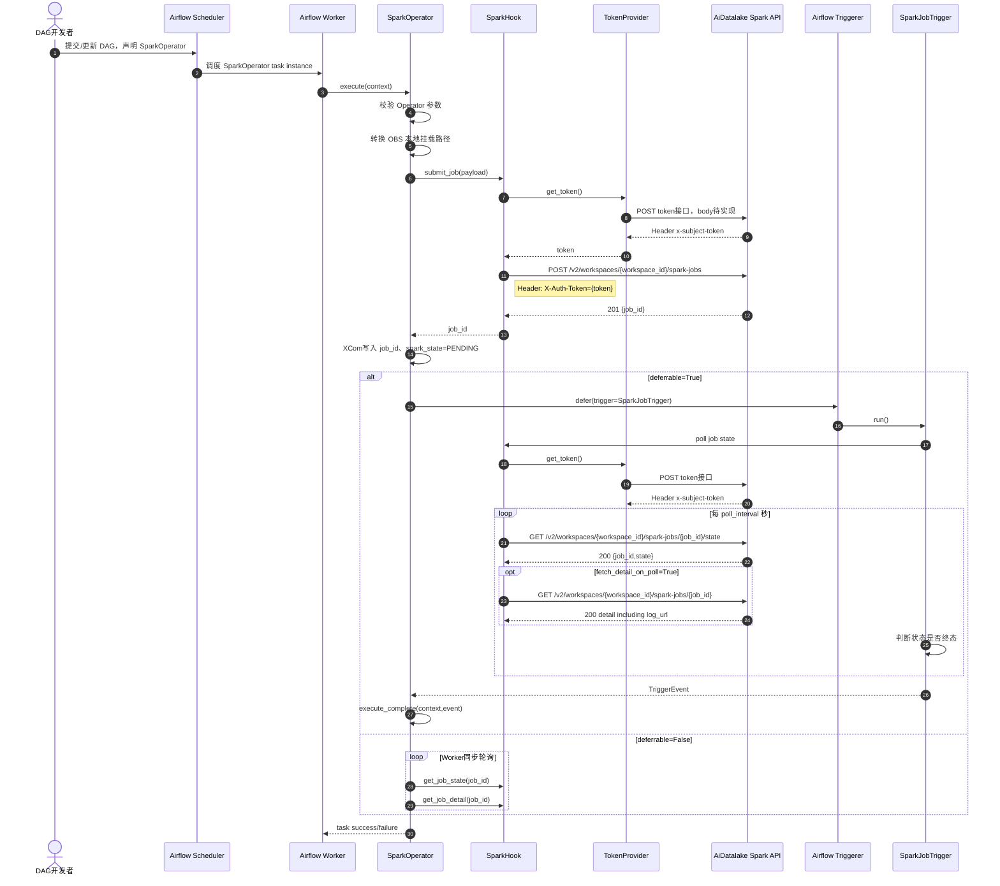
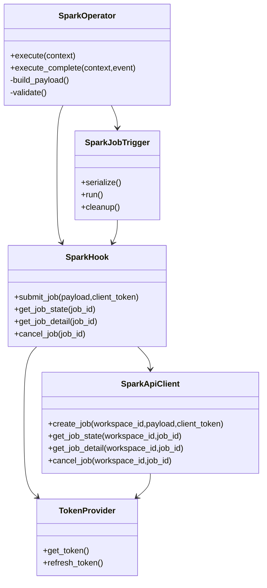

# Airflow 3.0 SparkOperator 完整设计文档

## 1. 设计范围

本文档描述 Airflow 3.0 框架下 `SparkOperator` 的完整业务流程、接口调用逻辑、模块分层和异常处理策略。

依据文档：

- `FE20260424744831-工作流支持Spark组件(1).md`
- `SF20260421655859-Spark组件(1).md`
- `AiDatalake-API-Spark-Specification(1).md`

关键调整：

- 不再调用 FE/SF 文档中提到的算力网关接口。
- Spark 作业创建、查询、取消直接调用 `AiDatalake-API-Spark-Specification` 中的 Spark 作业相关 API。
- 不再使用文档旧方案中的固定网关 Token。
- 每次访问 Spark API 前，通过 token 获取接口拿到 token。
- token 获取接口为 `POST` 请求，真实 URL 和 body 待实现。
- token 从响应 Header `x-subject-token` 获取。
- 后续 Spark API 请求统一添加 Header：`X-Auth-Token: {token}`。

## 2. 总体业务流程

### 2.1 业务主链路



### 2.2 用户侧使用流程

1. DAG 开发者在 DAG 文件中引入 `SparkOperator`。
2. 测试环境直接在 Operator 参数中配置 Spark API 与 token 获取接口：
   - `spark_base_url`
   - `auth_url`
   - `auth_body`
   - `auth_headers`
   - `request_timeout`
   - `verify`
3. DAG 参数中声明：
   - `workspace_id`
   - `name`
   - `endpoint_name`
   - `spark_version`
   - `job_type`
   - 对应作业类型参数。
4. Airflow 调度执行 task。
5. Operator 提交远端 Spark 作业。
6. Operator 进入异步等待。
7. Trigger 轮询远端状态。
8. Spark 作业成功时 Airflow task 成功。
9. Spark 作业失败、取消或超时时 Airflow task 失败。
10. 用户在 Airflow UI 可通过 XCom 或日志看到 `job_id`、`spark_state`、`log_url`。

## 3. 外部接口调用设计

### 3.1 Token 获取接口

接口当前待实现，但调用方式固定：

```text
POST {auth_url}
```

请求 Header：

```text
Content-Type: application/json
{auth_headers}
```

请求 Body：

```json
{
  "TODO": "真实token获取body待实现"
}
```

响应要求：

```text
x-subject-token: {token}
```

处理规则：

- 只从响应 Header 获取 token。
- 不从响应 Body 获取 token。
- Header 名大小写不敏感。
- 缺少 `x-subject-token` 时抛出认证异常。
- token 不写入 XCom。
- token 不序列化到 Trigger 参数。
- token 不打印日志。

### 3.2 创建 Spark 作业

接口：

```text
POST {spark_base_url}/v2/workspaces/{workspace_id}/spark-jobs
```

请求 Header：

```text
X-Auth-Token: {token}
X-Client-Token: {uuid}
Content-Type: application/json
```

成功响应状态码：

```text
201
```

成功响应：

```json
{
  "job_id": "ac8111bf-3601-4905-8ddd-b41d3e636a4e"
}
```

请求 Body 总体结构：

```json
{
  "name": "spark-etl-job",
  "endpoint_name": "endpoint1",
  "job_config": {
    "job_type": "spark_python_job",
    "spark_py_parameter": {}
  },
  "spark_version": "3.3.2",
  "job_agency": "agency1",
  "resource_config": {},
  "spark_config": {},
  "image_config": {},
  "restore_strategy": {},
  "description": "demo",
  "labels": [],
  "catalog_name": "catalog1",
  "logging_config": {}
}
```

失败响应：

```json
{
  "error_code": "0103.1001",
  "error_msg": "Parameter check errors occur.",
  "request_id": "request-id"
}
```

### 3.3 查询 Spark 作业状态

接口：

```text
GET {spark_base_url}/v2/workspaces/{workspace_id}/spark-jobs/{job_id}/state
```

请求 Header：

```text
X-Auth-Token: {token}
```

成功响应状态码：

```text
200
```

成功响应：

```json
{
  "job_id": "ac8111bf-3601-4905-8ddd-b41d3e636a4e",
  "state": "RUNNING"
}
```

状态枚举：

| 状态 | 含义 | 是否终态 | Airflow 行为 |
| --- | --- | --- | --- |
| `PENDING` | 等待中 | 否 | 继续轮询 |
| `QUEUED` | 排队中 | 否 | 继续轮询 |
| `RUNNING` | 运行中 | 否 | 继续轮询 |
| `CANCELING` | 取消中 | 否 | 继续轮询 |
| `SUCCEED` | 成功 | 是 | task success |
| `FAILED` | 失败 | 是 | task failed |
| `CANCELED` | 已取消 | 是 | task failed |
| `QUEUED_TIMEOUT` | 排队超时 | 是 | task failed |
| `RUNNING_TIMEOUT` | 运行超时 | 是 | task failed |

### 3.4 查看 Spark 作业详情

接口：

```text
GET {spark_base_url}/v2/workspaces/{workspace_id}/spark-jobs/{job_id}
```

请求 Header：

```text
X-Auth-Token: {token}
```

用途：

- 获取 `log_url`。
- 获取完整作业信息。
- 终态时补充写入最终状态信息。

关键响应字段：

```json
{
  "job_id": "ac8111bf-3601-4905-8ddd-b41d3e636a4e",
  "state": "RUNNING",
  "job_config": {},
  "resource_config": {},
  "retry_times": 0,
  "create_time": 1764061598000,
  "start_time": 1764061600000,
  "end_time": null,
  "log_url": "obs://bucket/logs/"
}
```

处理规则：

- `log_url` 写入 XCom。
- 详情查询失败不改变作业状态判断。
- 轮询阶段详情接口失败只记录 warning。
- 终态阶段详情接口失败不影响最终 task 状态。

### 3.5 取消 Spark 作业

接口：

```text
POST {spark_base_url}/v2/workspaces/{workspace_id}/spark-jobs/{job_id}/cancel
```

请求 Header：

```text
X-Auth-Token: {token}
```

成功响应状态码：

```text
204
```

无响应 Body。

可取消状态：

```python
{"PENDING", "QUEUED", "RUNNING"}
```

取消幂等状态：

```python
{"CANCELING", "CANCELED", "FAILED", "QUEUED_TIMEOUT", "RUNNING_TIMEOUT", "SUCCEED"}
```

处理规则：

- 取消前优先查询一次状态。
- 可取消状态调用取消接口。
- 已终态不抛错，记录日志后返回。
- 取消接口 `204` 视为成功。
- `404` 且本地正在清理时按幂等成功处理。
- `401` 刷新 token 后重试一次。

## 4. Spark 作业类型设计

### 4.1 作业类型枚举

```python
SPARK_JOB_TYPES = {
    "spark_jar_job",
    "spark_python_job",
    "spark_sql_scripting_job",
}
```

| 作业类型 | 说明 | 是否本期可提交 |
| --- | --- | --- |
| `spark_jar_job` | Spark jar 作业 | 是 |
| `spark_python_job` | Python Spark 作业 | 是 |
| `spark_sql_scripting_job` | SQL 脚本作业，预留 | 待确认，默认支持请求体构造 |

### 4.2 spark_jar_job 请求体映射

Operator 参数：

```python
spark_jar_parameter={
    "main_class": "com.example.Main",
    "main_args": ["arg1", "arg2"],
    "main_jar": "/mnt/OBS/bucket/jars/main.jar",
    "dependency_jars": ["/mnt/OBS/bucket/jars/dep.jar"],
    "dependency_files": [],
    "dependency_archives": [],
    "dependency_py_files": [],
}
```

转换后请求体：

```json
{
  "job_config": {
    "job_type": "spark_jar_job",
    "spark_jar_parameter": {
      "main_class": "com.example.Main",
      "main_args": ["arg1", "arg2"],
      "main_jar": "obs://bucket/jars/main.jar",
      "dependency_jars": ["obs://bucket/jars/dep.jar"],
      "dependency_files": [],
      "dependency_archives": [],
      "dependency_py_files": []
    }
  }
}
```

校验规则：

- `main_jar` 必填。
- `main_jar` 必须是 OBS URI 或可转换的 `/mnt/OBS` 路径。
- `main_args` 最多 100 个。
- `main_args` 每项长度不超过 512。

### 4.3 spark_python_job 请求体映射

Operator 参数：

```python
spark_py_parameter={
    "main_python_file": "/mnt/OBS/bucket/jobs/main.py",
    "main_args": ["--input", "/mnt/OBS/bucket/input", "--output", "/mnt/OBS/bucket/output"],
    "dependency_jars": [],
    "dependency_files": [],
    "dependency_archives": [],
    "dependency_py_files": ["/mnt/OBS/bucket/libs/common.zip"],
}
```

转换后请求体：

```json
{
  "job_config": {
    "job_type": "spark_python_job",
    "spark_py_parameter": {
      "main_python_file": "obs://bucket/jobs/main.py",
      "main_args": ["--input", "obs://bucket/input", "--output", "obs://bucket/output"],
      "dependency_jars": [],
      "dependency_files": [],
      "dependency_archives": [],
      "dependency_py_files": ["obs://bucket/libs/common.zip"]
    }
  }
}
```

校验规则：

- `main_python_file` 必填。
- `main_python_file` 支持 `.py`、`.zip`。
- 依赖路径必须是 OBS URI 或可转换的 `/mnt/OBS` 路径。

### 4.4 spark_sql_scripting_job 请求体映射

Operator 参数：

```python
spark_sql_scripting_parameter={
    "sql_scripting_file": "/mnt/OBS/bucket/sql/job.sql",
    "sql_scripting_parameters": {
        "type": "batch",
        "externalCatalog": "catalog1"
    },
    "dependency_jars": [],
    "sql_scripting_result_to_obs": false,
}
```

转换后请求体：

```json
{
  "job_config": {
    "job_type": "spark_sql_scripting_job",
    "spark_sql_scripting_parameter": {
      "sql_scripting_file": "obs://bucket/sql/job.sql",
      "sql_scripting_parameters": {
        "type": "batch",
        "externalCatalog": "catalog1"
      },
      "dependency_jars": [],
      "sql_scripting_result_to_obs": false
    }
  }
}
```

校验规则：

- `sql_scripting_file` 必填。
- 当前不调用 SparkSql 作业相关 API，即不调用 `/v2/workspaces/{workspace_id}/spark-sqls`。
- 是否允许正式提交该类型由业务确认；实现可通过 `enable_sql_scripting_job` 开关控制。

## 5. Operator 参数设计

### 5.1 连接与接口配置参数

```python
spark_base_url: str | None = None
auth_url: str | None = None
auth_body: dict | None = None
auth_headers: dict | None = None
request_timeout: int = 30
verify: bool = True
spark_conn_id: str | None = None
auth_conn_id: str | None = None
workspace_id: str
```

说明：

- `spark_base_url`：Spark API base URL，测试环境推荐直接传入。
- `auth_url`：token 获取接口 URL，测试环境推荐直接传入。
- `auth_body`：token 获取接口 POST body。
- `auth_headers`：token 获取接口额外 Header。
- `request_timeout`：Spark API 与 token API 请求超时时间。
- `verify`：HTTPS 证书校验开关。
- `spark_conn_id`：未传直接配置时，从 Airflow Connection 读取 Spark API 地址。
- `auth_conn_id`：未传直接配置时，从 Airflow Connection 读取 token 配置；为空时复用 `spark_conn_id`。
- `workspace_id`：Spark API 路径参数。

配置优先级：

1. 同时传入 `spark_base_url` 和 `auth_url` 时，使用直接配置模式，不读取 Airflow Connection。
2. 未传完整直接配置时，回退到 Connection 模式。
3. Connection 模式下默认使用 `aidatalake_spark`。

Connection Extra 示例：

```json
{
  "auth_url": "TODO",
  "auth_body": {},
  "auth_headers": {},
  "timeout": 30,
  "verify": true
}
```

### 5.2 作业基础参数

```python
name: str
endpoint_name: str
spark_version: str
job_type: str
job_agency: str | None = None
description: str | None = None
catalog_name: str | None = None
labels: list[dict[str, str]] | None = None
```

### 5.3 作业类型参数

```python
spark_jar_parameter: dict | None = None
spark_py_parameter: dict | None = None
spark_sql_scripting_parameter: dict | None = None
```

规则：

- `job_type=spark_jar_job` 时，只允许 `spark_jar_parameter`。
- `job_type=spark_python_job` 时，只允许 `spark_py_parameter`。
- `job_type=spark_sql_scripting_job` 时，只允许 `spark_sql_scripting_parameter`。
- 传入非当前类型参数时抛出参数异常。

### 5.4 资源与运行参数

```python
resource_config: dict | None = None
spark_config: dict[str, str] | None = None
image_config: dict | None = None
restore_strategy: dict | None = None
logging_config: dict | None = None
```

### 5.5 Airflow 运行控制参数

```python
deferrable: bool = True
poll_interval: int = 30
max_poll_failures: int = 10
convert_obs_path: bool = True
local_obs_prefix: str = "/mnt/OBS"
fetch_detail_on_poll: bool = True
enable_sql_scripting_job: bool = False
```

规则：

- `poll_interval` 不得小于 10 秒。
- `max_poll_failures` 默认 10。
- `deferrable=True` 时释放 Worker，由 Triggerer 轮询。
- `deferrable=False` 时 Worker 同步轮询，不推荐长作业使用。

## 6. 模块分层设计

### 6.1 目录结构

```text
src/
  airflow_provider_aidatalake/
    __init__.py
    operators/
      __init__.py
      spark.py
    hooks/
      __init__.py
      spark.py
    triggers/
      __init__.py
      spark.py
    clients/
      __init__.py
      http_client.py
      token.py
      spark_api.py
    models/
      __init__.py
      spark.py
    utils/
      __init__.py
      obs_path.py
      validation.py
    exceptions.py
```

### 6.2 分层职责

| 层 | 模块 | 职责 |
| --- | --- | --- |
| Operator | `operators/spark.py` | Airflow task 生命周期、参数接收、XCom、defer、execute_complete |
| Hook | `hooks/spark.py` | Airflow Connection 读取，组合 TokenProvider 和 SparkApiClient |
| Trigger | `triggers/spark.py` | Triggerer 异步轮询，终态事件，cleanup 取消 |
| Client | `clients/spark_api.py` | Spark API URL 拼接、请求、响应解析 |
| Token | `clients/token.py` | POST 获取 token，从 Header 提取 `x-subject-token` |
| HTTP | `clients/http_client.py` | requests/aiohttp 封装、超时、重试、错误映射 |
| Model | `models/spark.py` | 状态枚举、作业类型、事件结构 |
| Utils | `utils/obs_path.py` | OBS 路径转换 |
| Utils | `utils/validation.py` | 参数校验 |
| Exceptions | `exceptions.py` | 统一异常类型 |

### 6.3 类关系



## 7. 详细调用逻辑

### 7.1 execute 提交逻辑

```text
SparkOperator.execute(context)
  1. 读取 task 参数
  2. 校验 job_type
  3. 校验当前 job_type 对应参数是否存在
  4. 校验资源参数、轮询参数
  5. 转换 OBS 路径
  6. 构建 Spark API 请求 payload
  7. 生成 X-Client-Token
  8. SparkHook.submit_job(payload, client_token)
      8.1 TokenProvider.get_token()
      8.2 POST token接口
      8.3 从 Header x-subject-token 取 token
      8.4 POST /v2/workspaces/{workspace_id}/spark-jobs
      8.5 解析 job_id
  9. XCom 写入 job_id
  10. XCom 写入 spark_state=PENDING
  11. deferrable=True:
      11.1 self.defer(trigger=SparkJobTrigger(...), method_name="execute_complete")
  12. deferrable=False:
      12.1 同步轮询直到终态
```

### 7.2 Trigger 轮询逻辑

```text
SparkJobTrigger.run()
  1. 创建 SparkHook
  2. failure_count = 0
  3. while True:
      3.1 get_job_state(job_id)
          3.1.1 若无 token，POST token接口获取 token
          3.1.2 GET /v2/workspaces/{workspace_id}/spark-jobs/{job_id}/state
      3.2 查询成功:
          3.2.1 failure_count = 0
          3.2.2 记录 state
      3.3 若 fetch_detail_on_poll=True:
          3.3.1 get_job_detail(job_id)
          3.3.2 若返回 log_url，放入事件 payload
          3.3.3 详情查询失败只记录 warning
      3.4 若 state 是终态:
          3.4.1 yield TriggerEvent(...)
          3.4.2 return
      3.5 若 state 非终态:
          3.5.1 await asyncio.sleep(poll_interval)
      3.6 查询异常:
          3.6.1 failure_count += 1
          3.6.2 若 401，刷新 token 后当前轮重试一次
          3.6.3 若 failure_count >= max_poll_failures，yield failure event
```

### 7.3 execute_complete 回调逻辑

```text
SparkOperator.execute_complete(context, event)
  1. 校验 event 格式
  2. 读取 job_id、state、log_url、message
  3. 写入 XCom:
      3.1 job_id
      3.2 spark_state
      3.3 log_url
  4. state == SUCCEED:
      4.1 return job_id
  5. state in FAILED/CANCELED/QUEUED_TIMEOUT/RUNNING_TIMEOUT:
      5.1 raise AirflowException
  6. 其它状态:
      6.1 raise AirflowException("Unexpected trigger event")
```

### 7.4 cleanup 取消逻辑

```text
SparkJobTrigger.cleanup()
  1. 捕获所有异常，避免 Airflow 静默吞掉后无日志
  2. 创建 SparkHook
  3. get_job_state(job_id)
  4. 若状态属于 PENDING/QUEUED/RUNNING:
      4.1 POST /v2/workspaces/{workspace_id}/spark-jobs/{job_id}/cancel
      4.2 204 视为取消请求已接受
  5. 若状态属于终态:
      5.1 记录幂等跳过
  6. 若查询状态失败:
      6.1 直接尝试 cancel_job(job_id)
  7. 若取消失败:
      7.1 记录错误，不继续抛出
```

说明：

- Deferrable Operator 进入 deferred 后，Worker 上的 `on_kill` 不适合作为唯一取消入口。
- 取消远端 Spark 作业主要放在 Trigger cleanup。
- `on_kill` 可作为非 deferrable 模式或提交后未 defer 前的兜底逻辑。

## 8. OBS 路径转换业务规则

### 8.1 转换规则

```text
/mnt/OBS/bucket/path -> obs://bucket/path
```

示例：

| 输入 | 输出 |
| --- | --- |
| `/mnt/OBS/demo/jobs/main.py` | `obs://demo/jobs/main.py` |
| `/mnt/OBS/demo/input` | `obs://demo/input` |
| `obs://demo/input` | `obs://demo/input` |

### 8.2 转换范围

- `spark_jar_parameter.main_jar`
- `spark_jar_parameter.dependency_jars`
- `spark_jar_parameter.dependency_files`
- `spark_jar_parameter.dependency_archives`
- `spark_jar_parameter.dependency_py_files`
- `spark_py_parameter.main_python_file`
- `spark_py_parameter.dependency_jars`
- `spark_py_parameter.dependency_files`
- `spark_py_parameter.dependency_archives`
- `spark_py_parameter.dependency_py_files`
- `spark_py_parameter.main_args` 中独立出现的路径值
- `spark_sql_scripting_parameter.sql_scripting_file`
- `spark_sql_scripting_parameter.dependency_jars`
- `spark_sql_scripting_parameter.sql_scripting_parameters` 中的字符串值
- `spark_config` 中的字符串值

### 8.3 不转换范围

- Spark 脚本文件内容。
- 非字符串字段。
- 非 `/mnt/OBS` 前缀的普通本地路径。
- URL，如 `http://`、`https://`。

## 9. XCom 设计

| Key | 写入时机 | 内容 |
| --- | --- | --- |
| `job_id` | 提交成功、终态回调 | Spark 作业 ID |
| `spark_state` | 提交成功、每次终态回调 | Spark 作业状态 |
| `log_url` | 查询详情成功 | Spark API 返回的日志 OBS 路径 |
| `spark_job_message` | 失败或异常 | 可读错误信息 |

不写入：

- token
- 请求 Header
- 完整认证响应
- 过大的作业详情

## 10. 异常与重试策略

### 10.1 Token 异常

| 场景 | 处理 |
| --- | --- |
| token 接口 URL 未配置 | Operator 参数异常，任务失败 |
| token 接口非 2xx | 任务失败或按 HTTP 策略重试 |
| 响应 Header 缺少 `x-subject-token` | 认证异常，任务失败 |
| Spark API 返回 401 | 刷新 token 后重试一次 |
| 刷新后仍 401 | 任务失败 |

### 10.2 Spark API 异常

| HTTP 状态码 | 处理 |
| --- | --- |
| 400 | 参数错误，不重试，任务失败 |
| 401 | 刷新 token 后重试一次 |
| 403 | 权限不足，不重试，任务失败 |
| 404 | 查询时任务失败；取消时可按幂等成功处理 |
| 429 | 退避重试 |
| 5xx | 按阶段重试策略处理 |

### 10.3 阶段性重试

提交阶段：

- 超时：30 秒。
- 重试：3 次。
- 退避：1s、2s、4s。
- 如果已拿到 `job_id` 但本地后续失败，尝试取消远端作业。

轮询阶段：

- 单次超时：10 秒。
- 轮询间隔：默认 30 秒，最小 10 秒。
- 连续失败阈值：10 次。
- 达到阈值后返回失败事件。

取消阶段：

- 超时：10 秒。
- 重试：2 次。
- 已终态：幂等成功。

## 11. 日志设计

### 11.1 运行日志字段

| 场景 | 日志字段 |
| --- | --- |
| 参数校验开始 | `action=validate_start, dag_id, task_id, job_type` |
| 参数校验失败 | `action=validate_failed, errors` |
| OBS 路径转换 | `action=obs_path_convert, original, converted` |
| token 获取开始 | `action=token_request_start, auth_url` |
| token 获取成功 | `action=token_request_success` |
| token 获取失败 | `action=token_request_failed, status_code, error` |
| 作业提交开始 | `action=spark_submit_start, workspace_id, name, endpoint_name` |
| 作业提交成功 | `action=spark_submit_success, job_id` |
| 作业提交失败 | `action=spark_submit_failed, status_code, error_code, request_id` |
| 状态轮询 | `action=spark_poll, job_id, state` |
| 详情查询 | `action=spark_detail, job_id, has_log_url` |
| 取消开始 | `action=spark_cancel_start, job_id` |
| 取消成功 | `action=spark_cancel_success, job_id` |
| cleanup 开始 | `action=trigger_cleanup_start, job_id` |
| cleanup 跳过 | `action=trigger_cleanup_skip, job_id, state` |
| cleanup 异常 | `action=trigger_cleanup_error, job_id, error` |

### 11.2 安全要求

- 日志不得打印 token。
- 日志不得打印完整认证 body 中的敏感字段。
- Header 记录时必须脱敏。

## 12. Airflow 3.0 适配设计

### 12.1 Operator 导入

使用 Airflow 3.0 公共接口：

```python
from airflow.sdk import BaseOperator
```

### 12.2 配置读取

优先使用 Operator 直接配置；未传完整直接配置时，使用 Airflow 3.0 公共接口读取 Connection。

设计目标：

- 避免直接访问 Airflow 元数据库。
- 避免使用 Airflow 2.x 内部路径。
- Hook 层负责组装客户端，Operator 不直接读取连接。
- 测试环境可完全绕过 Airflow Connection。

### 12.3 Trigger

Trigger 只序列化必要字段：

```python
{
  "spark_conn_id": None,
  "auth_conn_id": None,
  "spark_base_url": "https://spark-api.example.com",
  "auth_url": "https://auth.example.com/v3/auth/tokens",
  "auth_body": {"TODO": "token request body"},
  "auth_headers": {},
  "request_timeout": 30,
  "verify": True,
  "workspace_id": "...",
  "job_id": "...",
  "poll_interval": 30,
  "max_poll_failures": 10,
  "fetch_detail_on_poll": True
}
```

Trigger 不序列化：

- token
- HTTP session
- Hook 实例
- Client 实例
- Connection 对象

说明：直接配置模式下，`auth_body` 与 `auth_headers` 会进入 Trigger 序列化参数。测试环境接受该方式；生产环境如包含敏感凭证，建议使用 Connection 模式。

## 13. 示例 DAG

```python
from airflow.sdk import DAG
from airflow_provider_aidatalake.operators.spark import SparkOperator

with DAG(dag_id="spark_operator_example") as dag:
    SparkOperator(
        task_id="spark_jar_task",
        spark_base_url="https://spark-api.example.com",
        auth_url="https://auth.example.com/v3/auth/tokens",
        auth_body={"TODO": "token request body"},
        auth_headers={},
        workspace_id="12345678-1234-1234-1234-123456789012",
        name="spark-jar-demo",
        endpoint_name="endpoint1",
        spark_version="3.3.2",
        spark_jar_parameter={
            "main_class": "com.example.Main",
            "main_jar": "/mnt/OBS/demo/jars/main.jar",
            "main_args": ["--input", "/mnt/OBS/demo/input"],
        },
        resource_config={
            "executor_number": 4,
            "driver_resource_spec": {"cpu": 2, "memory": "4GB", "disk": 100},
            "executor_resource_spec": {"cpu": 2, "memory": "4GB", "disk": 100},
        },
        restore_strategy={
            "max_retry": 0,
            "queued_timeout": 10800,
            "running_timeout": -1,
        },
        deferrable=True,
        poll_interval=30,
    )
```

## 14. 测试设计

### 14.1 单元测试

Token：

- token 接口使用 POST。
- 从 Header `x-subject-token` 提取 token。
- 缺少 Header 抛出异常。
- Spark API 401 后刷新 token 并重试一次。

Spark API：

- 创建作业调用 `POST /v2/workspaces/{workspace_id}/spark-jobs`。
- 查询状态调用 `GET /v2/workspaces/{workspace_id}/spark-jobs/{job_id}/state`。
- 查询详情调用 `GET /v2/workspaces/{workspace_id}/spark-jobs/{job_id}`。
- 取消作业调用 `POST /v2/workspaces/{workspace_id}/spark-jobs/{job_id}/cancel`。
- 每个 Spark API 请求都包含 `X-Auth-Token`。

参数映射：

- `spark_jar_job` 映射 `spark_jar_parameter`。
- `spark_python_job` 映射 `spark_py_parameter`。
- `spark_sql_scripting_job` 映射 `spark_sql_scripting_parameter`。
- 非当前 job_type 参数传入时报错。

OBS：

- `/mnt/OBS/bucket/path` 转为 `obs://bucket/path`。
- 已经是 `obs://` 的路径不变。
- 普通本地路径不误转换。

Trigger：

- 非终态继续轮询。
- `SUCCEED` 返回成功事件。
- `FAILED`、`CANCELED`、`QUEUED_TIMEOUT`、`RUNNING_TIMEOUT` 返回失败事件。
- 连续失败达到阈值返回失败事件。
- cleanup 对可取消状态调用 cancel。
- cleanup 对终态跳过 cancel。

### 14.2 集成测试

使用 mock HTTP 服务模拟：

1. token 接口返回 Header `x-subject-token`。
2. 创建 Spark 作业返回 `201` 和 `job_id`。
3. 状态接口返回 `PENDING -> QUEUED -> RUNNING -> SUCCEED`。
4. 详情接口返回 `log_url`。
5. 取消接口返回 `204`。
6. token 过期返回 `401`，刷新 token 后成功。

### 14.3 DAG 解析测试

验证 Airflow 3.0 环境下示例 DAG 可正常 import。

## 15. 待业务确认项

实现前需要确认：

1. token 获取接口真实 URL。
2. token 获取接口真实请求 body。
3. token 获取接口是否需要额外 Header。
4. `workspace_id` 由 Operator 参数传入，还是从 Connection Extra 读取。
5. `spark_sql_scripting_job` 本期是正式开放，还是仅保留结构并默认禁用。
6. `log_url` 是否只写入 Spark API 返回的 OBS 路径，还是必须继续调用 WorkspaceCoreService 生成下载链接。
7. Python 包名是否确定为 `airflow_provider_aidatalake`。
